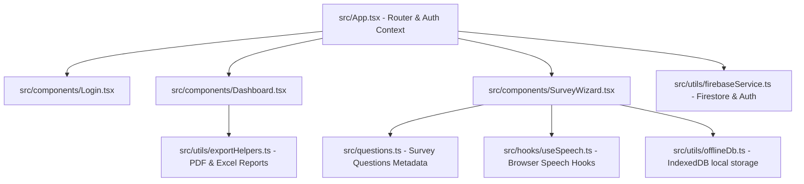

# Health Survey Platform - Redesign PDF Report & Kiosk Download Integration

We will upgrade the exported single-patient PDF report/receipt to match a premium visual layout (based on the user's uploaded dashboard screenshot) and add a direct "Download PDF Report" button on the patient's survey completion screen.

## User Review Required

> [!IMPORTANT]
> - **PDF Redesign Layout**:
>   - **Page 1**: Clean title header, metadata grid (Date, Time, UHID), a styled 2-column "Personal Details" card, a colored "Health Survey Summary" grid (Yes, No, N/A, Total counts), and a "Thank you" footer banner.
>   - **Page 2**: A structured "Health Survey Responses" table showing the list of question items paired with colored status badges (Yes in Green, No in Red, text details in Orange), followed by a "Friendly Reminder" disclaimer box at the bottom.
> - **Kiosk Patient Download**: Adds a prominent "Download PDF Report" button on the survey success screen. This allows patients to save/print their receipt immediately after submission.
> - **Clean and Compact ZIP Package**: A separate clean package `heart-survey-clean-package.zip` has been prepared containing only the source code for external auditing and deployment.

## Open Questions

> [!NOTE]
> 1. **Auto-Start Speech**: In modern browsers (Chrome/Edge), speech output requires a user interaction gesture (e.g., clicking "Start Survey") before the speech engine is allowed to speak. We will start the conversational voice flow as soon as the user clicks the "Language Selection" or "Start Survey" button to comply with this standard.
> 2. **Charts & Visualization Library**: We will install `recharts` to render high-grade, responsive dashboards for the doctor/admin stats.

---

## Proposed Changes

We will refactor the project from a monolithic file into a modular structure:

### 1. Survey Definition and Local Storage

#### [NEW] [questions.ts](file:///c:/Users/HP/Downloads/srinivasa-heart-foundation-health-survey%20(1)/src/questions.ts)
- Define a structured array of all survey questions (85 items) across the 10 medical sections.
- For each question, specify `id`, `section`, `type` (text, number, boolean, select), options, validation rules, and dynamic `condition` routing functions (e.g. hiding Covid details if `hadCovid` is `false`, female specific fields if gender is not `Female`).

#### [NEW] [offlineDb.ts](file:///c:/Users/HP/Downloads/srinivasa-heart-foundation-health-survey%20(1)/src/utils/offlineDb.ts)
- Use standard `IndexedDB` to implement a local repository for:
  - `surveys_offline`: completed surveys that are pending upload.
  - `survey_draft`: a single auto-saved draft tracking the current question ID and partially filled state.
  - `users_offline`: local credentials cache to verify roles during offline mode.
- Export helpers to get/set drafts, save finalized surveys offline, and retrieve all offline records.

---

### 2. Services and Custom Hooks

#### [NEW] [firebaseService.ts](file:///c:/Users/HP/Downloads/srinivasa-heart-foundation-health-survey%20(1)/src/utils/firebaseService.ts)
- Connect frontend to standard Firebase SDK authentication and Firestore.
- Define Firestore collections:
  - `patients`: index patient profiles by UHID.
  - `surveys`: store detailed survey responses.
  - `users`: store staff roles.
  - `analytics`: store daily aggregates.
- Export query helpers to fetch survey stats (gender ratios, disease counts, age groups) for the dashboard.
- Handle offline cache writing natively through Firebase Client SDK offline persistence.

#### [NEW] [useSpeech.ts](file:///c:/Users/HP/Downloads/srinivasa-heart-foundation-health-survey%20(1)/src/hooks/useSpeech.ts)
- Implement a stateful custom React hook wrap for browser `SpeechSynthesis` and `webkitSpeechRecognition`.
- Coordinate:
  - Automatic speaking of the current question.
  - Transitioning to listening mode upon speech end.
  - Checking the speech recognition confidence score.
  - Prompting retry messages when no speech is detected.
  - Handling confirmation state: *"You said Ramu. Is that correct? (Yes/No)"*.
  - Gracefully fallback to manual text entry after 2 failures.

---

### 3. Modular Frontend Components

#### [NEW] [Login.tsx](file:///c:/Users/HP/Downloads/srinivasa-heart-foundation-health-survey%20(1)/src/components/Login.tsx)
- Render a premium hospital-grade login page.
- Allow staff to choose their target role (Admin, Doctor, Receptionist) or authenticate via email/password.
- Support offline validation against seeded fallback accounts.

#### [NEW] [Dashboard.tsx](file:///c:/Users/HP/Downloads/srinivasa-heart-foundation-health-survey%20(1)/src/components/Dashboard.tsx)
- Build a responsive stats panel utilizing `recharts`.
- Display summaries: total surveys, gender distribution, age group bars, BP/Diabetes counts, smoking, and heart disease history.
- Include a searchable patient registry to filter submissions by UHID or Name.
- Include one-click actions to download full PDF reports or Excel sheets for any patient.
- Provide a Sync Center displaying pending local offline records with a manual upload sync trigger.

#### [MODIFY] [SurveyWizard.tsx](file:///c:/Users/prana/Downloads/srinivasa-heart-foundation-health-survey/src/components/SurveyWizard.tsx)
- Integrate a local state variable `pdfLoading` and import `triggerPdfExport` from `exportHelpers`.
- Update the survey completed success screen (`wizardPhase === 'success'`) to render a **"Download PDF Report"** button. This gives patients the ability to download/print their individual survey receipt immediately upon finishing.

#### [MODIFY] [exportHelpers.ts](file:///c:/Users/prana/Downloads/srinivasa-heart-foundation-health-survey/src/utils/exportHelpers.ts)
- Redesign `triggerPdfExport` to generate a 2-page, high-aesthetic report corresponding to the user's dashboard screenshot:
  - **Page 1**: Left-aligned structured info: Title ("Health Survey Report"), subtitle ("Your Health, Our Priority"), metadata cards (Date, Time, UHID) in bordered blocks, a clean 2-column personal details table card, a colored metrics grid (Yes/No/NA/Total counts), and appreciation disclaimer footer.
  - **Page 2**: Title ("Health Survey Responses"), status badge legends, a numbered table listing all questions alongside colored response badges (Yes in Green, No in Red, text answers in Orange), and a "Friendly Reminder" box at the bottom.

---

## Verification Plan

### Automated Tests
- Run `npm run lint` to verify compilation.
- Run `npm run build` to verify webpack/vite production bundling.

### Manual Verification
1. **Patient-Facing Download**: Complete a survey, land on the success screen, and verify that the "Download PDF Report" button is visible and generates a PDF on click.
2. **PDF Aesthetic Audit**: Open the downloaded PDF and verify that it matches the layout in the screenshot (including two columns, metadata boxes, summary counts, and the question response table).
3. **Admin Dashboard Export**: Log in to the dashboard and trigger both the individual PDF reports and the bulk PDF/CSV exports to ensure they function properly.
